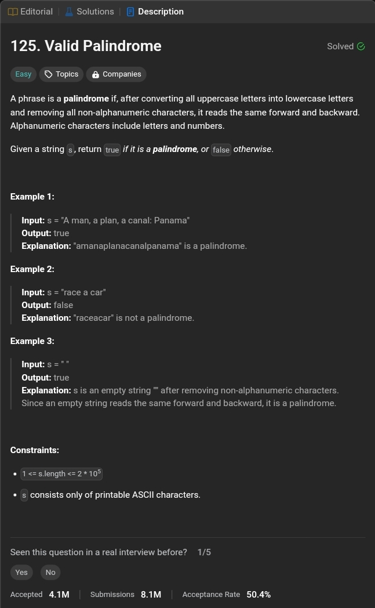

# 344. Reverse String


<div dir="rtl">
 - اكتب دالة (function) تقوم بعكس محتوى مصفوفة من الحروف (char array) <br>
يجب عليك تنفيذ ذلك عن طريق تعديل المصفوفة الأصلية نفسها (in-place) دون استخدام مساحة إضافية (O(1)) من الذاكرة.

</div>

## solutions

### 1. Array
``` java
public class Solution {
    public void reverseString(char[] s) {
        char[] tmp = new char[s.length];
        for (int i = s.length - 1, j = 0; i >= 0; i--, j++) {
            tmp[j] = s[i];
        }
        for (int i = 0; i < s.length; i++) {
            s[i] = tmp[i];
        }
    }
}
```
#### Time & Space Complexity 
Time complexity:  O(n)

Space complexity:  O(n)
### 2. Recursion

``` java
public class Solution {
    public void reverseString(char[] s) {
        reverse(s, 0, s.length - 1);
    }
    
    private void reverse(char[] s, int l, int r) {
        if (l < r) {
            reverse(s, l + 1, r - 1);
            char temp = s[l];
            s[l] = s[r];
            s[r] = temp;
        }
    }
}
```
#### Time & Space Complexity 
Time complexity:  O(n)

Space complexity:  O(n) for recursion stack.
### 3. Stack

``` java
public class Solution {
    public void reverseString(char[] s) {
        Stack<Character> stack = new Stack<>();
        for (char c : s) {
            stack.push(c);
        }
        int i = 0;
        while (!stack.isEmpty()) {
            s[i++] = stack.pop();
        }
    }
}
```
#### Time & Space Complexity 
Time complexity:  O(n)

Space complexity:  O(n)
### 4. Built-In Function

``` java
public class Solution {
    public void reverseString(char[] s) {
        List<Character> list = new ArrayList<>();
        for (char c : s) {
            list.add(c);
        }
        Collections.reverse(list);
        
        for (int i = 0; i < s.length; i++) {
            s[i] = list.get(i);
        }
    }
}
```

#### Time & Space Complexity 
Time complexity:  O(n)

Space complexity:  O(n)

### 5. Two Pointers
``` java
public class Solution {
    public void reverseString(char[] s) {
        int l = 0, r = s.length - 1;
        while (l < r) {
            char temp = s[l];
            s[l] = s[r];
            s[r] = temp;
            l++;
            r--;
        }
    }
}
```
#### Time & Space Complexity
Time complexity:  O(n)

Space complexity:  O(1)


# 125. Valid Palindrome


<div dir="rtl">
تعتبر الجمله ( palindrome ) اذا , بعد تحويل جميع الحروف الكبيرة إلى صغيرة وإزالة جميع الأحرف غير الأبجدية الرقمية ( non-alphanumeric )  ، تُقرأ بنفس الطريقة للأمام والخلف.
 تشمل الأحرف الأبجدية الرقمية ( Alphanumeric ) الحروف والأرقام.  

</div>

## solutions

### 1. Reverse String
```java
public class Solution {
    public boolean isPalindrome(String s) {
        StringBuilder newStr = new StringBuilder();
        for (char c : s.toCharArray()) {
            if (Character.isLetterOrDigit(c)) {
                newStr.append(Character.toLowerCase(c));
            }
        }
        return newStr.toString().equals(newStr.reverse().toString());
    }
}
```
#### Time & Space Complexity
Time complexity:  O(n)

Space complexity:  O(n)

### 2. Two Pointers
```java
public class Solution {
    public boolean isPalindrome(String s) {
        int l = 0, r = s.length() - 1;

        while (l < r) {
            while (l < r && !alphaNum(s.charAt(l))) {
                l++;
            }
            while (r > l && !alphaNum(s.charAt(r))) {
                r--;
            }
            if (Character.toLowerCase(s.charAt(l)) != Character.toLowerCase(s.charAt(r))) {
                return false;
            }
            l++; r--;
        }
        return true;
    }

    public boolean alphaNum(char c) {
        return (c >= 'A' && c <= 'Z' || 
                c >= 'a' && c <= 'z' || 
                c >= '0' && c <= '9');
    }
}
```
#### Time & Space Complexity
Time complexity: O(n)

Space complexity:  O(1)


<br>
<div dir="rtl">
حل تاني الطف شوي ( حلى 😁 )
</div>

```java
public class Solution {
    public boolean isPalindrome(String s) {
        s = s.toLowerCase();
        int length = s.length();
        int l = 0, r = length - 1;
        char lChar, rChar;
        while(l<r){
            lChar = s.charAt(l);
            rChar = s.charAt(r);
            
            if(!alphaNum(lChar)){
                l++;
                continue;
            }
            if(!alphaNum(rChar)){
                r--;
                continue;
            }
            
            if(lChar != rChar)
                return false;
            
            l++;
            r--;
        }
        return true;
    }

    public boolean alphaNum(char c) {
        return (c >= 'a' && c <= 'z') || (c >= '0' && c <= '9');
    }
}
```
#### Time & Space Complexity
Time complexity: O(n)

Space complexity:  O(1)

## Additional Solutions ...

### 3. Regular Expression & Reverse String

```java
public class Solution {
    public boolean isPalindrome(String s) {
      
        s = s.replaceAll("[^a-zA-Z0-9]", "").toLowerCase();
        
        StringBuilder reversed = new StringBuilder(s).reverse();
        return s.equals(reversed.toString());
    }
}
```
#### Time & Space Complexity
Time complexity: O(n)

Space complexity:  O(n)
