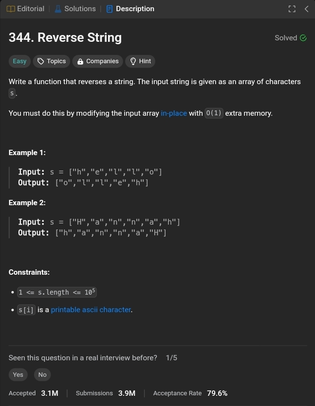

# 344. Reverse String


<div dir="rtl">
 - اكتب دالة (function) تقوم بعكس محتوى مصفوفة من الحروف (char array) <br>
يجب عليك تنفيذ ذلك عن طريق تعديل المصفوفة الأصلية نفسها (in-place) دون استخدام مساحة إضافية (O(1)) من الذاكرة.

</div>

## solutions

### 1. Array
``` java
public class Solution {
    public void reverseString(char[] s) {
        char[] tmp = new char[s.length];
        for (int i = s.length - 1, j = 0; i >= 0; i--, j++) {
            tmp[j] = s[i];
        }
        for (int i = 0; i < s.length; i++) {
            s[i] = tmp[i];
        }
    }
}
```
#### Time & Space Complexity 
Time complexity:  O(n)

Space complexity:  O(n)
### 2. Recursion

``` java
public class Solution {
    public void reverseString(char[] s) {
        reverse(s, 0, s.length - 1);
    }
    
    private void reverse(char[] s, int l, int r) {
        if (l < r) {
            reverse(s, l + 1, r - 1);
            char temp = s[l];
            s[l] = s[r];
            s[r] = temp;
        }
    }
}
```
#### Time & Space Complexity 
Time complexity:  O(n)

Space complexity:  O(n) for recursion stack.
### 3. Stack

``` java
public class Solution {
    public void reverseString(char[] s) {
        Stack<Character> stack = new Stack<>();
        for (char c : s) {
            stack.push(c);
        }
        int i = 0;
        while (!stack.isEmpty()) {
            s[i++] = stack.pop();
        }
    }
}
```
#### Time & Space Complexity 
Time complexity:  O(n)

Space complexity:  O(n)
### 4. Built-In Function

``` java
public class Solution {
    public void reverseString(char[] s) {
        List<Character> list = new ArrayList<>();
        for (char c : s) {
            list.add(c);
        }
        Collections.reverse(list);
        
        for (int i = 0; i < s.length; i++) {
            s[i] = list.get(i);
        }
    }
}
```

#### Time & Space Complexity 
Time complexity:  O(n)

Space complexity:  O(n)

### 5. Two Pointers
``` java
public class Solution {
    public void reverseString(char[] s) {
        int l = 0, r = s.length - 1;
        while (l < r) {
            char temp = s[l];
            s[l] = s[r];
            s[r] = temp;
            l++;
            r--;
        }
    }
}
```
#### Time & Space Complexity
Time complexity:  O(n)

Space complexity:  O(1)